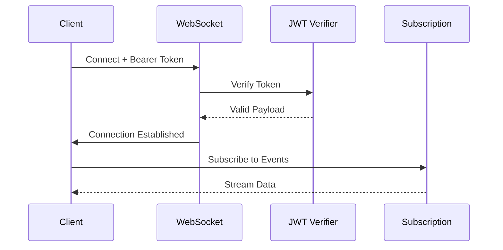

export const metadata = {
  title: 'GraphQL Integration - NestJS Cognito',
  description: 'GraphQL authentication and authorization with AWS Cognito.'
}

# GraphQL Integration

GraphQL-specific decorators and guards for Cognito authentication.

## Installation

<CodeGroup>
```sh {{ title: 'pnpm' }}
pnpm add @nestjs-cognito/graphql
```
```sh {{ title: 'npm' }}
npm i @nestjs-cognito/graphql
```
```sh {{ title: 'yarn' }}
yarn add @nestjs-cognito/graphql
```
</CodeGroup>

## Authentication

```typescript
import { GqlAuthentication, GqlCognitoUser } from '@nestjs-cognito/graphql';
import type { CognitoJwtPayload } from '@nestjs-cognito/core';

@Resolver()
export class UserResolver {
  @Query()
  @GqlAuthentication()
  async me(@GqlCognitoUser() user: CognitoJwtPayload) {
    return {
      id: user.sub,
      username: user.username,
      email: user.email
    };
  }
}
```

## Authorization

```typescript
import { GqlAuthorization } from '@nestjs-cognito/graphql';

@Resolver()
export class AdminResolver {
  @Mutation()
  @GqlAuthorization(['admin'])
  async adminOperation() {
    return { success: true };
  }
}
```

## Public Routes

```typescript
import { GqlPublicRoute } from '@nestjs-cognito/graphql';

@Resolver()
@GqlAuthentication()
export class ProductResolver {
  @Query()
  @GqlPublicRoute()
  async products() {
    return [{ id: 1, name: 'Product 1' }];
  }
}
```

## Token Types

Use specialized decorators for runtime validation:

```typescript
import { GqlCognitoIdUser, GqlCognitoAccessUser } from '@nestjs-cognito/graphql';
import type { CognitoIdTokenPayload, CognitoAccessTokenPayload } from '@nestjs-cognito/core';

@Resolver()
export class UserResolver {
  // ID token (user profile)
  @Query()
  @GqlAuthentication()
  async profile(@GqlCognitoIdUser() user: CognitoIdTokenPayload) {
    return {
      email: user.email,
      groups: user['cognito:groups']
    };
  }

  // Access token (authorization)
  @Query()
  @GqlAuthentication()
  async tokenInfo(@GqlCognitoAccessUser() token: CognitoAccessTokenPayload) {
    return {
      scope: token.scope,
      clientId: token.client_id
    };
  }
}
```

## Subscriptions

Secure GraphQL subscriptions with JWT authentication:

<Mermaid>



</Mermaid>

```typescript
import { ApolloDriver, ApolloDriverConfig } from '@nestjs/apollo';
import { GraphQLModule } from '@nestjs/graphql';
import { CognitoJwtVerifier } from 'aws-jwt-verify';

@Module({
  imports: [
    GraphQLModule.forRootAsync<ApolloDriverConfig>({
      driver: ApolloDriver,
      useFactory: (cognitoVerifier: CognitoJwtVerifier) => ({
        autoSchemaFile: true,
        subscriptions: {
          'graphql-ws': {
            onConnect: async (context) => {
              const token = context.connectionParams?.authorization?.replace('Bearer ', '');
              if (!token) throw new Error('Missing token');

              const payload = await cognitoVerifier.verify(token);
              return { user: payload };
            },
          },
        },
      }),
      inject: [CognitoJwtVerifier],
    }),
  ],
})
export class AppModule {}
```

**Protected subscription:**

```typescript
@Resolver()
export class NotificationResolver {
  @Subscription()
  @GqlAuthentication()
  notificationAdded(@GqlCognitoUser() user: CognitoJwtPayload) {
    return pubSub.asyncIterator(`notifications.${user.sub}`);
  }
}
```

**Client:**

```typescript
import { createClient } from 'graphql-ws';

const wsClient = createClient({
  url: 'ws://localhost:3000/graphql',
  connectionParams: {
    authorization: `Bearer ${accessToken}`,
  },
});
```