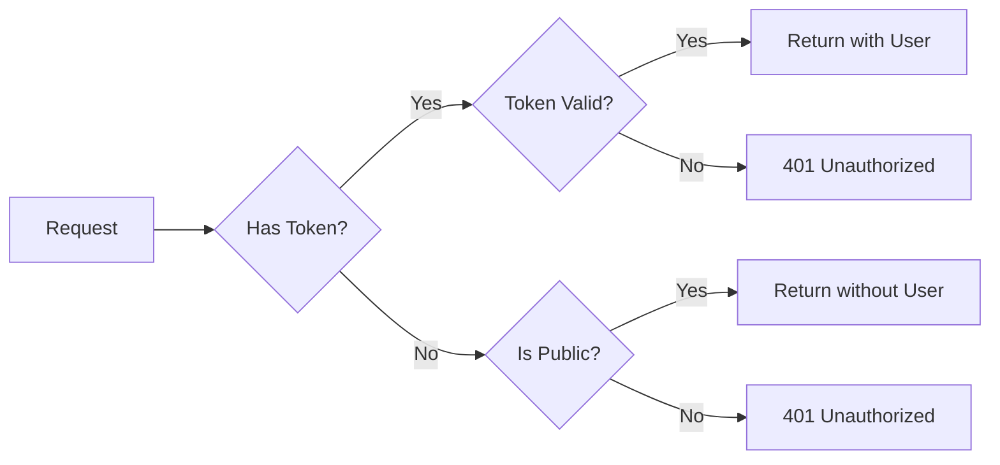

export const metadata = {
  title: 'Public Routes - NestJS Cognito',
  description: 'Allow unauthenticated access while still checking tokens when provided.'
}

# Public Routes

Sometimes you want a route that's accessible to everyone but can still recognize logged-in users. Like a homepage that says "Welcome back, John" if you're logged in, or just "Welcome" if you're not.

That's what `@PublicRoute` does.

## How it works

```ts
import { Authentication, PublicRoute, CognitoUser } from '@nestjs-cognito/auth';
import { Controller, Get } from '@nestjs/common';

@Controller('api')
@Authentication()
export class AppController {
  @PublicRoute()
  @Get('welcome')
  welcomeUser(@CognitoUser() user?: User) {
    return user 
      ? `Welcome back, ${user.username}!` 
      : 'Welcome, guest!';
  }
}
```

## Three scenarios

**No token**: Request goes through. User is `undefined`.

**Valid token**: Request goes through. User data is available.

**Invalid token**: Request is rejected with 401. Security still matters.

<Mermaid>



</Mermaid>


## Common uses

### Personalized welcome

```ts
@Controller('api')
@Authentication()
export class AppController {
  @PublicRoute()
  @Get('welcome')
  getMessage(@CognitoUser('username') username?: string) {
    return `Hello ${username ?? 'stranger'}`;
  }
}
```

### Content with preview

```ts
@Controller('content')
@Authentication()
export class ContentController {
  @PublicRoute()
  @Get('article/:id')
  async getArticle(
    @Param('id') id: string,
    @CognitoUser() user?: User
  ) {
    const article = await this.articleService.findById(id);

    return user
      ? article              // Full content for logged-in users
      : article.preview;     // Preview for guests
  }
}
```

### Mixed controller

```ts
@Controller('api')
@Authentication()
export class ApiController {
  @PublicRoute()
  @Get('basic-info')
  getBasicInfo() {
    return { version: '1.0.0' };  // Public
  }

  @Get('sensitive-info')
  getSensitiveInfo(@CognitoUser() user: User) {
    return { secretData: 'only for authenticated' };  // Protected
  }
}
```