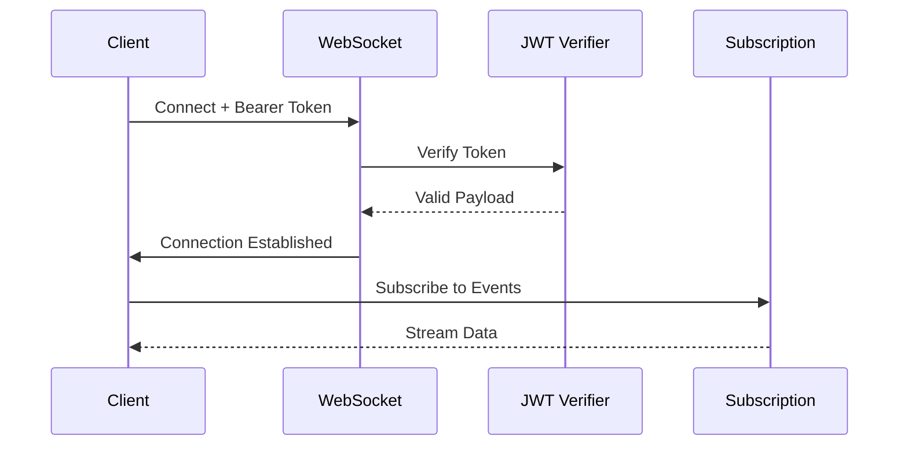

export const metadata = {
  title: 'GraphQL - NestJS Cognito',
  description: 'Protect GraphQL resolvers with Cognito authentication.'
}

# GraphQL

The `@nestjs-cognito/auth` decorators work on resolvers: `@Authentication()`, `@Authorization()`, `@PublicRoute()` and `@CognitoUser()`. A global `AuthenticationGuard` also covers GraphQL operations.

<Note>
`@nestjs-cognito/graphql` and its `Gql*` decorators are deprecated since 4.0. They are aliases of the `@nestjs-cognito/auth` decorators and will be removed in 5.0.
</Note>

## Authentication

```typescript
import { Authentication, CognitoUser } from '@nestjs-cognito/auth';
import type { CognitoJwtPayload } from '@nestjs-cognito/core';

@Resolver()
export class UserResolver {
  @Query()
  @Authentication()
  async me(@CognitoUser() user: CognitoJwtPayload) {
    return {
      id: user.sub,
      username: user.username,
      email: user.email
    };
  }
}
```

## Authorization

```typescript
import { Authorization } from '@nestjs-cognito/auth';

@Resolver()
export class AdminResolver {
  @Mutation()
  @Authorization(['admin'])
  async adminOperation() {
    return { success: true };
  }
}
```

## Public Routes

```typescript
import { Authentication, PublicRoute } from '@nestjs-cognito/auth';

@Resolver()
@Authentication()
export class ProductResolver {
  @Query()
  @PublicRoute()
  async products() {
    return [{ id: 1, name: 'Product 1' }];
  }
}
```

## Access and ID tokens

```typescript
import { Authentication, CognitoAccessUser, CognitoIdUser } from '@nestjs-cognito/auth';
import type { CognitoIdTokenPayload, CognitoAccessTokenPayload } from '@nestjs-cognito/core';

@Resolver()
export class UserResolver {
  @Query()
  @Authentication()
  async profile(@CognitoIdUser() user: CognitoIdTokenPayload) {
    return {
      email: user.email,
      groups: user['cognito:groups']
    };
  }

  @Query()
  @Authentication()
  async tokenInfo(@CognitoAccessUser() token: CognitoAccessTokenPayload) {
    return {
      scope: token.scope,
      clientId: token.client_id
    };
  }
}
```

## Subscriptions

Subscriptions use WebSockets. You need to verify the token during connection.

<Note>
This section has not been checked against NestJS 12 and graphql-ws yet.
</Note>

<Mermaid>



</Mermaid>

```typescript
import { ApolloDriver, ApolloDriverConfig } from '@nestjs/apollo';
import { GraphQLModule } from '@nestjs/graphql';
import { CognitoJwtVerifier } from 'aws-jwt-verify';

@Module({
  imports: [
    GraphQLModule.forRootAsync<ApolloDriverConfig>({
      driver: ApolloDriver,
      useFactory: (cognitoVerifier: CognitoJwtVerifier) => ({
        autoSchemaFile: true,
        subscriptions: {
          'graphql-ws': {
            onConnect: async (context) => {
              const token = context.connectionParams?.authorization?.replace('Bearer ', '');
              if (!token) throw new Error('Missing token');

              const payload = await cognitoVerifier.verify(token);
              return { user: payload };
            },
          },
        },
      }),
      inject: [CognitoJwtVerifier],
    }),
  ],
})
export class AppModule {}
```

Protect subscriptions:

```typescript
@Resolver()
export class NotificationResolver {
  @Subscription()
  @Authentication()
  notificationAdded(@CognitoUser() user: CognitoJwtPayload) {
    return pubSub.asyncIterator(`notifications.${user.sub}`);
  }
}
```

Client side:

```typescript
import { createClient } from 'graphql-ws';

const wsClient = createClient({
  url: 'ws://localhost:3000/graphql',
  connectionParams: {
    authorization: `Bearer ${accessToken}`,
  },
});
```