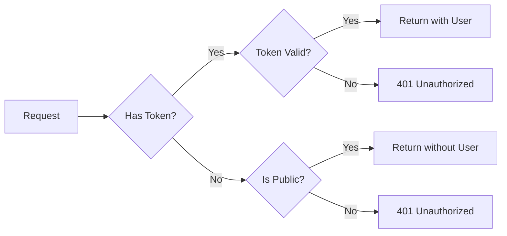

<h1 align="center">@nestjs-cognito/auth</h1>

[](https://coveralls.io/github/Lokicoule/nestjs-cognito?branch=main)


## Description

`@nestjs-cognito/auth` is a library for [NestJS](https://github.com/nestjs/nest) that provides authentication and authorization decorators and guards for applications using [AWS Cognito](https://docs.aws.amazon.com/cognito/latest/developerguide/what-is-amazon-cognito.html). This library is built on top of `@nestjs-cognito/core` and `aws-jwt-verify`.

## Installation

To install the library, use npm:

```bash
npm install @nestjs-cognito/auth
```

## Configuration

The `@nestjs-cognito/auth` library offers both _synchronous_ and _asynchronous_ configuration options. To use the library, a few configuration parameters are required, including the AWS Cognito user pool ID and client ID. Detailed information about the available options can be found in the [@nestjs-cognito/core](https://www.npmjs.com/package/@nestjs-cognito/core) documentation.

### Synchronous Configuration

The `@nestjs-cognito/auth` library can be easily integrated into your NestJS application by importing the `CognitoAuthModule` from the `@nestjs-cognito/auth` package.

Use the `CognitoAuthModule.register` method with options from the [CognitoModuleOptions interface](https://www.npmjs.com/package/@nestjs-cognito/core)

Here's an example of how you can import the `CognitoAuthModule` into your NestJS application:

```ts
import { CognitoAuthModule } from "@nestjs-cognito/auth";
import { Module } from "@nestjs/common";

@Module({
  imports: [
    CognitoAuthModule.register({
      jwtVerifier: {
        userPoolId: "user_pool_id",
        clientId: "client_id",
        tokenUse: "id",
      },
    }),
  ],
})
export class AppModule {}
```

In this example, the CognitoAuthModule is imported and registered with the following configuration options:

- `jwtVerifier`:
  - `userPoolId`: The ID of your AWS Cognito user pool.
  - `clientId`: The client ID of your AWS Cognito user pool.
  - `tokenUse`: The type of token to be used. Since December 2023, AWS Cognito supports access token customization, making it the recommended choice for RBAC implementation over ID tokens.

Note: You can also define an identity provider without importing the [CognitoModule](https://www.npmjs.com/package/@nestjs-cognito/core) module by using the CognitoAuthModule.

### Asynchronous Configuration

With `CognitoModule.registerAsync` you can import a ConfigModule and inject ConfigService to use it in `useFactory` method.
Alternatively, you can use `useExisting` or `useClass`.
You can find more information about asynchronous configuration in the [NestJS documentation](https://docs.nestjs.com/techniques/configuration).

```ts
import { CognitoAuthModule } from "@nestjs-cognito/auth";
import { Module } from "@nestjs/common";
import { ConfigModule, ConfigService } from "@nestjs/config";

@Module({
  imports: [
    CognitoAuthModule.registerAsync({
      imports: [ConfigModule],
      useFactory: async (configService: ConfigService) => ({
        jwtVerifier: {
          userPoolId: configService.get("COGNITO_USER_POOL_ID") as string,
          clientId: configService.get("COGNITO_CLIENT_ID"),
          tokenUse: "id",
        },
      }),
      inject: [ConfigService],
    }),
  ],
})
export class AppModule {}
```

## Usage

Once the `@nestjs-cognito/auth` module is installed and configured, you can use the following decorators and guards to protect your controllers and routes.

### Built-in Decorators and Guards

- Use the `@Authentication` decorator or the `@UseGuards(AuthenticationGuard)` syntax to apply the `AuthenticationGuard` to a controller and ensure that the user is authenticated.
- Use the `@Authorization` decorator or the `@UseGuards(AuthorizationGuard)` syntax to apply the `AuthorizationGuard` to a controller and ensure that the user is authorized.
- Decorate method arguments with the `@CognitoUser` decorator to retrieve the payload information extracted from the JWT.

<b>Note: During the authorization process, the authentication of the user is already checked, so there's no need to use the `authentication` guard or decorator.</b>

In addition, you can find more details about `@UseGuards` decorator from the official [NestJS](https://docs.nestjs.com/guards) documentation.

### `Authentication`

#### `@Authentication` Decorator

To configure the authentication, you'll need to use the `@Authentication` decorator. You can add the `@Authentication` decorator to controllers or routes:

```ts
import { Authentication } from "@nestjs-cognito/auth";
import { Controller } from "@nestjs/common";

@Controller("dogs")
@Authentication()
export class DogsController {
  // Your routes here
}
```

#### `AuthenticationGuard`

You can also use the `AuthenticationGuard` to secure individual routes or endpoint.

To use the `AuthenticationGuard`, you'll need to use the `@UseGuards` decorator:

```ts
import { AuthenticationGuard } from "@nestjs-cognito/auth";
import { UseGuards } from "@nestjs/common";

@Controller("dogs")
@UseGuards(AuthenticationGuard)
export class DogsController {
  // Your routes here
}
```

<details>
<summary>
Examples of using authentication:
</summary>

```ts
import {
  Authentication,
  AuthenticationGuard,
  CognitoUser,
} from "@nestjs-cognito/auth";
import { Controller, Get, UseGuards } from "@nestjs/common";
import type { CognitoJwtPayload } from "@nestjs-cognito/core";

@Controller("dogs")
@Authentication()
export class DogsController {
  @Get()
  findAll(@CognitoUser("email") email: string): string {
    return "This action returns all my dogs";
  }
}

@Controller("cats")
@UseGuards(AuthenticationGuard)
export class CatsController {
  @Get()
  findAll(@CognitoUser(["groups", "email", "username"]) me): string {
    return "This action returns all my cats";
  }
}

@Controller("dogs")
export class DogsController {
  @Get()
  @Authentication()
  findAll(@CognitoUser() CognitoJwtPayload): string {
    return "This action returns all my dogs";
  }
}

@Controller("cats")
export class CatsController {
  @Get()
  @UseGuards(AuthenticationGuard)
  findAll(@CognitoUser(["groups", "email", "username"]) me): string {
    return "This action returns all my cats";
  }
}
```

</details>

### `Authorization`

#### `@Authorization` Decorator

The `@Authorization` decorator can be used to secure an entire controller. You can specify the `allowedGroups`, `requiredGroups`, and/or `prohibitedGroups` for a given controller.

For example:

```ts
@Controller("dogs")
@Authorization({
  allowedGroups: ["user", "admin"],
  requiredGroups: ["moderator"],
  prohibitedGroups: ["visitor"],
})
export class DogsController {
  @Get()
  findAll(@CognitoUser() CognitoJwtPayload): string {
    return "This action returns all my dogs";
  }
}
```

You can also specify the `allowedGroups` as an array of strings:

```ts
@Controller("cats")
@Authorization(["user"]) // allowedGroups by default
export class CatsController {
  @Get()
  findAll(@CognitoUser("username") username: string): string {
    return "This action returns all my cats";
  }
}
```

#### `AuthorizationGuard`

The `AuthorizationGuard` can be used to secure a single route, allowing you to specify the `allowedGroups`, `requiredGroups`, and/or `prohibitedGroups` for a given endpoint.

For example:

```ts
@Controller("cats")
@UseGuards(
  AuthorizationGuard({
    allowedGroups: ["user", "admin"],
    requiredGroups: ["moderator"],
    prohibitedGroups: ["visitor"],
  })
)
export class CatsController {
  @Get()
  findAll(@CognitoUser("email") email: string): string {
    return "This action returns all my cats";
  }
}
```

You can also use the `AuthorizationGuard` directly on a route:

```ts
@Controller("cats")
export class CatsController {
  @Get()
  @UseGuards(AuthorizationGuard(["user", "admin"]))
  findAll(@CognitoUser() me: CognitoJwtPayload): string {
    return "This action returns all my cats";
  }
}
```

<details>

<summary>
Examples of using authorization:
</summary>

```ts
import {
  Authorization,
  AuthorizationGuard,
  CognitoUser,
} from "@nestjs-cognito/auth";
import { Controller, Get, UseGuards } from "@nestjs/common";
import type { CognitoJwtPayload } from "@nestjs-cognito/core";

@Controller("dogs")
@Authorization({
  allowedGroups: ["user", "admin"],
  requiredGroups: ["moderator"],
  prohibitedGroups: ["visitor"],
})
export class DogsController {
  @Get()
  findAll(@CognitoUser() CognitoJwtPayload): string {
    return "This action returns all my dogs";
  }
}

@Controller("cats")
@Authorization(["user"]) // allowedGroups by default
export class CatsController {
  @Get()
  findAll(@CognitoUser("username") username: string): string {
    return "This action returns all my cats";
  }
}

@Controller("cats")
@UseGuards(
  AuthorizationGuard({
    allowedGroups: ["user", "admin"],
    requiredGroups: ["moderator"],
    prohibitedGroups: ["visitor"],
  })
)
export class CatsController {
  @Get()
  findAll(@CognitoUser("email") email: string): string {
    return "This action returns all my cats";
  }
}

@Controller("cats")
export class CatsController {
  @Get()
  @UseGuards(AuthorizationGuard(["user", "admin"]))
  findAll(@CognitoUser() me: CognitoJwtPayload): string {
    return "This action returns all my cats";
  }
}
```

</details>

### `@CognitoUser`

To retrieve the cognito user from an incoming request, you'll need to use the `@CognitoUser` decorator. You can use the decorator to inject the entire `CognitoJwtPayload` object or specific properties from the payload, such as the `username` or `email`. Note that the `cognito:` namespace is automatically managed, so you don't need to include it when accessing properties such as `cognito:username` or `cognito:groups`.

It's important to note that this decorator must be used in conjunction with an authentication guard, such as `Authentication` or `Authorization`.

For example:

```ts
@Controller()
@Authentication()
export class YourController {
  @Get()
  findAll(@CognitoUser() cognitoJwtPayload: CognitoJwtPayload): string {
    return "This action returns all the data";
  }
}
```

#### <b>Optional property name</b>

You can specify the name of the property to inject the user into by passing a string as an argument.

```ts
import { Authentication, CognitoUser } from "@nestjs-cognito/auth";

@Controller()
@Authentication()
export class YourController {
  @Get()
  getData(@CognitoUser("email") email: string): any {
    // Use the `email` string
  }
}
```

#### <b>Multiple properties</b>

You can extract multiple properties from the cognito user by passing an array of strings.

```ts
import { Authentication, CognitoUser } from "@nestjs-cognito/auth";

@Controller()
@Authentication()
export class YourController {
  @Get()
  getData(
    @CognitoUser(["groups", "email", "username"])
    {
      groups,
      email,
      username,
    }: {
      groups: string[];
      email: string;
      username: string;
    }
  ): any {
    // Use the `groups` and/or `username` and `email` strings
  }
}
```

### `@PublicRoute`

Makes routes public while still enforcing valid authentication when credentials are provided. This decorator is perfect for implementing "login to see more" features while maintaining security.

#### How it works

- Without authentication token: Route is accessible
- With valid token: Route is accessible and user information is available
- With invalid token: Returns 401 Unauthorized (security is never compromised)

#### Example

```typescript
@Controller("api")
@Authentication() // All routes require auth by default
export class AppController {
  // Basic usage - public route with optional auth
  @Get("welcome")
  @PublicRoute()
  welcomeUser(@CognitoUser() user?: User) {
    if (user) {
      return `Welcome back ${user.username}!`;
    }
    return "Hello! Login to see your dashboard";
  }

  // Real-world example - product page with member benefits
  @Get("products/:id")
  @PublicRoute()
  getProduct(@Param("id") id: string, @CognitoUser() user?: User) {
    const product = this.getProduct(id);

    return {
      ...product,
      // Show different prices based on authentication
      price: user ? this.getMemberPrice(product) : product.normalPrice,
      // Additional data only for authenticated users
      memberDetails: user
        ? {
            inWishlist: this.isInWishlist(user.id, id),
            stock: this.getStockLevel(id),
            reviews: this.getMemberReviews(id),
          }
        : null,
    };
  }

  // Example with both @Authentication and @PublicRoute
  @Get("dashboard")
  @Authentication()
  @PublicRoute()
  getDashboard(@CognitoUser() user?: User) {
    // If token is provided, it MUST be valid
    // Invalid tokens will return 401 even though route is public
    if (user) {
      return this.getUserDashboard(user);
    }
    return this.getPublicDashboard();
  }
}
```

#### When to use it

- Public pages that offer enhanced features for authenticated users
- Landing pages with personalization opportunities
- Preview functionality that expands with authentication
- Hybrid public/private APIs where authentication is optional but must be valid when provided

#### Authentication Flow



## License

<b>@nestjs-cognito/auth</b> is [MIT licensed](LICENSE).
